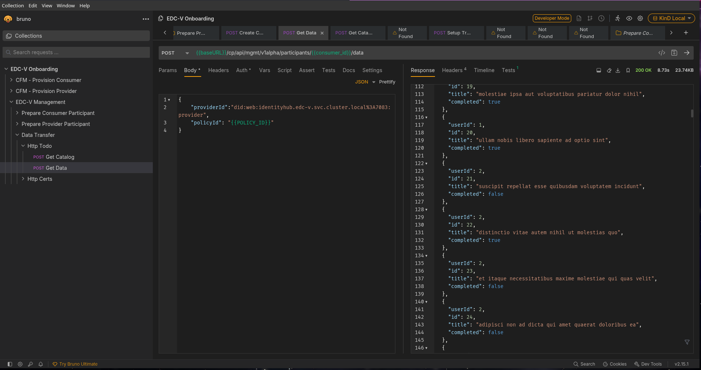
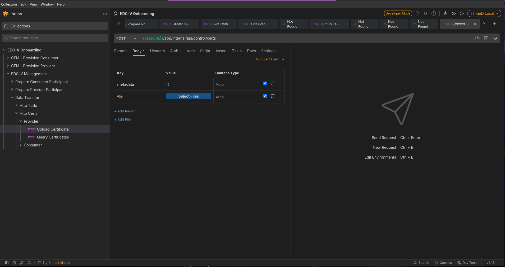
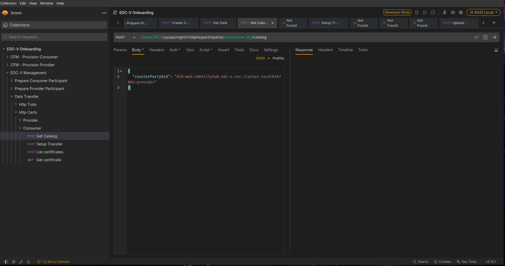

# JAD—Just Another Demonstrator

JAD is a demonstrator that deploys a fully-fledged dataspace as a Software-as-a-Service (SaaS) solution in Kubernetes.
This is to illustrate how Cloud Service Providers (CSPs) can deploy and manage dataspace components in their own cloud
infrastructure.

For that, JAD uses the "Virtual Connector" project: https://github.com/eclipse-edc/Virtual-Connector

Such a dataspace requires – at a minimum – the following components:

- a control plane: handles protocol messages and catalog data for each participant
- IdentityHub: responsible for managing Verifiable Credentials (presentation and storage)
- IssuerService: issues Verifiable Credentials to participants' IdentityHubs
- a data plane: performs the actual data transfer
- an identity provider: handles API authentication of management APIs. We are using Keycloak here.
- a vault: used to securely store sensitive data, such as the private keys etc. We are using Hashicorp Vault.
- a database server: contains persistent data of all the components. We are using PostgreSQL.
- a messaging system: used to process asynchronous messages. We are using NATS for this.

## Required tools and apps

- KinD: a basic Kubernetes runtime inside a single Docker container.
- Java 17+
- Docker
- `kubectl`
- macOS or Linux as an operating system. **Windows is not natively supported**!
- a POSIX-compliant shell (e.g., bash, zsh)
- [Bruno](https://www.usebruno.com) (or similar). The API requests here are optimized for Bruno, but other tools work as
  well. Bruno does offer a CLI client, but that does not handle token refresh automatically, so we'll use the GUI.
- [optional]: a Kubernetes monitoring tool like K9S, Lens, Headlamp, etc. Not required, but certainly helpful.

_All shell commands are executed from the root of the project unless stated otherwise._

## Getting started

### 1. Create KinD cluster

To create a KinD cluster, run:

```shell
cp ~/.kube/config ~/.kube/config.bak # to save your existing kubeconfig
kind create cluster -n edcv --config kind.config.yaml --kubeconfig ~/.kube/edcv-kind.conf
ln -sf ~/.kube/edcv-kind.conf ~/.kube/config # to use KinD's kubeconfig
```

Next, deploy the NGINX ingress controller:

```shell
kubectl apply -f https://kind.sigs.k8s.io/examples/ingress/deploy-ingress-nginx.yaml
kubectl wait --namespace ingress-nginx \
  --for=condition=ready pod \
  --selector=app.kubernetes.io/component=controller \
  --timeout=90s
```

### 2. Deploy applications

#### 2.1 Option 1: Use pre-built images

There are pre-built images for all JAD apps available from [GHCR](https://github.com/Metaform/jad/packages) and the
Connector Fabric Manager images are available from
the [CFM GitHub Repository](https://github.com/Metaform/connector-fabric-manager/packages). Those are tested and we
strongly recommend using them.

#### 2.2 Option 2: Build images from source

However, for the adventurous among us who want to build them from source, for example, because they've modified the code
and now want to see it in action, please follow the following steps to build and load JAD apps:

- build Docker images:

  ```shell
  ./gradlew dockerize
  ```

  This will build the Docker images for all components and store them in the local Docker registry. JAD requires a
  special version of PostgreSQL, in particular, it installs the `wal2json` extension. You can create this special
  Postgres
  version by running

  ```shell
  docker buildx build -f launchers/postgres/Dockerfile --platform linux/amd64,linux/arm64 -t ghcr.io/metaform/jad/postgres:wal2json launchers/postgres
  ```

  this will create the image `postgres:wal2json` for both amd64 and arm64 (e.g., Apple Silicon) architectures. Add
  platforms as needed.

- load images into KinD: KinD has no access to the host's docker context, so we need to load the images into KinD. Note
  that other Kubernetes runtimes such as Minikube do things differently. Verify that all images are there by running
  `docker images`. Then run:

  ```shell
  kind load docker-image \
      ghcr.io/metaform/jad/controlplane:latest \
      ghcr.io/metaform/jad/identity-hub:latest \
      ghcr.io/metaform/jad/issuerservice:latest \
      ghcr.io/metaform/jad/dataplane:latest \
      ghcr.io/metaform/jad/postgres:wal2json -n edcv
  ```

  or if you're a bash God:

  ```shell
  kind load docker-image -n edcv $(docker images --format "{{.Repository}}:{{.Tag}}" | grep '^ghcr.io/metaform/jad.*:latest')
  ```

- build CFM docker images locally:
  ```shell
  cd /path/to/cfm/
  make load-into-kind
  ```
  This builds all CFM components' docker images and loads them into your KinD cluster, assuming that your KinD cluster
  is named `"edcv"`. If not, set the cluster name for the make file accordingly:
  ```
  cd /path/to/cfm/
  make load-into-kind KIND_CLUSTER_NAME=your_cluster_name`. 
  ```
  Note that individual `make` targets for all CFM components exist, for example `make load-into-kind-pmanager`.

- modify the deployment manifests of the components you want to load locally by setting the `imagePullPolicy: Never`
  which forces KinD to rely on local images rather than pulling them. This can be done with search-and-replace from your
  favorite editor, or you can do it from the command line by running
  ```shell
  sed -i "s/imagePullPolicy:.*Always/imagePullPolicy: Never/g" <FILENAME>
  ```
  **CAUTION Mac users**: this requires GNU-sed. By default, macOS, has a special version of `sed` so you will have
  to [install GNU sed first](https://medium.com/@bramblexu/install-gnu-sed-on-mac-os-and-set-it-as-default-7c17ef1b8f64)
- For the EDC-V components, the relevant files are `controlplane.yaml`, `dataplane.yaml`, `identityhub.yaml` and
  `issuerservice.yaml`
- as a simplification, and to modify the image pull policy of both EDC-V _and_ CFM components, run:
  ```shell
  grep -rlZ "imagePullPolicy: Always" k8s/apps  | xargs sed -i "s/imagePullPolicy:.*Always/imagePullPolicy: Never/g"
  ```
  For this, both the EDC-V and CFM docker images must be built locally!!

### 3. Deploy the services

JAD uses plain Kubernetes manifests to deploy the services. All the manifests are located in the [k8s](./k8s) folder.
While it is possible to just use the Kustomize plugin and running `kubectl apply -k k8s/`, you may experience nasty race
conditions because some services depend on others to be fully operational before they can start properly.

The recommended way is to deploy infrastructure services first, and application services second. This can be done
by running:

```shell
kubectl apply -f k8s/base/

# Wait for the infrastructure services to be ready:
kubectl wait --namespace edc-v \
            --for=condition=ready pod \
            --selector=type=edcv-infra \
            --timeout=90s

kubectl apply -f k8s/apps/

# Wait for seed jobs to be ready:
kubectl wait --namespace edc-v \
            --for=condition=complete job --all \
            --timeout=90s
```

Here's a copy-and-pasteable command to delete and redeploy everything:

```shell
kubectl delete -k k8s/; \
kubectl apply -f k8s/base && \
kubectl wait --namespace edc-v \
            --for=condition=ready pod \
            --selector=type=edcv-infra \
            --timeout=90s && \
kubectl apply -f k8s/apps && \
kubectl wait --namespace edc-v \
            --for=condition=complete job --all \
            --timeout=90s
```

_Note: the `";"` after `kubectl delete -k k8s/` is on purpose for robustness, to allow the command to fail if no
resources are deployed yet._

This deploys all the services in the correct order. The services are deployed in the `edc-v` namespace. Please verify
that everything got deployed correctly by running `kubectl get deployments -n edcv`. This should output something like:

```text
NAME            READY   UP-TO-DATE   AVAILABLE             AGE
cfm-agents                1/1     1            1           117m
cfm-provision-manager     1/1     1            1           117m
cfm-tenant-manager        1/1     1            1           117m
controlplane              1/1     1            1           117m
dataplane                 1/1     1            1           117m
identityhub               1/1     1            1           117m
issuerservice             1/1     1            1           117m
keycloak                  1/1     1            1           110m
nats                      1/1     1            1           110m
postgres                  1/1     1            1           110m
vault                     1/1     1            1           110m
```

### 4. Inspect your deployment

- database: the PostgreSQL database is accessible from outside the cluster via
  `jdbc:postgresql://postgres.localhost/controlplane`, username `cp`, password `cp`.
- vault: the vault is accessible from outside the cluster via `http://vault.localhost`, using token `root`.
- keycloak: access `http://keycloak.localhost/` and use username `admin` and password `admin`

**Caution: these are security-relevant credentials and must not be used in production! EVER!!**

In addition, you should see the following Kubernetes jobs (`k get jobs -n edcv`) running:

```text
NAME                       STATUS     COMPLETIONS   DURATION   AGE
issuerservice-seed         Complete   1/1           13s        119m
provision-manager-seed   Complete   1/1           15s        119m
vault-bootstrap            Complete   1/1           19s        120m
```

Those are needed to populate the databases and the vault with initial data.

### 5. Prepare the data space

In addition to the initial seed data, a few bits and pieces are required for it to become fully operational. These can
be put in place by running the REST requests in the `CFM - Provision Consumer` folder and in the
`CFM - Provision Provider`
in the [Bruno collection](./requests/EDC-V%20Onboarding). Be sure to select the `"KinD Local"` environment in
Bruno.


Those requests can be run manually, one after the other, or via Bruno's "Run" feature. It may be necessary to manually
refresh the access token in the `"Auth*"` tab.

This creates a consumer and a provider participant using the Connector Fabric Manager's (CFM) REST API. CFM does a lot
of the heavy lifting by doing the following:

- creates access credentials for both the Vault and the Administration APIs
- creates a `ParticipantContext` in the control plane
- creates a `ParticipantContext` in IdentityHub
- registers the new `ParticipantContext` with the IssuerService
- requests VerifiableCredentials from the IssuerService

N.B.: the `Get Participant Profile` may need to be run repeatedly until all entries in the `vpas` array have a
`"state": "active"` field. This is because the deployment is an asynchronous process and all agents need to run before
the profile is activated.

## Seeding EDC-V CEL Expressions

For evaluating policies EDC-V makes usage of the CEL (Common Expression Language) engine. To demonstrate this, we
will create a simple CEL expression that allows data access only to participants that possess a valid Membership
Credential.

Run the requests in the `Create CEL expression` request in folder `EDC-V Management/Prepare consumer participant` in the
same Bruno collection to create the CEL expression in the ControlPlane.


## Seeding the Provider

Before we can transfer data, we need to seed the Provider with an asset, a policy and a contract definition. This is
done by running the requests in the `EDC-V Management/Provider` folder in the same Bruno collection. Again, make sure
to select the
`"KinD Local"` environment.


**If all requests ran successfully, you should now have access credentials for both the consumer and the provider!**

## Transfer Data

Now that both participants are set up, we can transfer data from the Provider to the Consumer.
There are two use case supported here:

- Http proxy
- Certificates sharing via HTTP

### Http proxy

EDC-V offers a one-stop-shop API to transfer data. This is achieved by two endpoints, one that fetches the catalog (
`Data Transfer/Http Todo/Get Catalog`) and another endpoint (`Data Transfer/Http Todo/Get Data`) that initiates the
contract negotiation,
waits for its successful completion, then starts the data transfer.

Perform the entire sequence by running both requests in the `Data Transfer/Http Todo` folder in Bruno:



This will request the catalog, which contains exactly one dataset, then initiates contract negotiation and data
transfer for that asset. If everything went well, the output should contain demo output
from https://jsonplaceholder.typicode.com/todos, something like:

```json lines
[
  {
    "userId": 1,
    "id": 1,
    "title": "delectus aut autem",
    "completed": false
  },
  {
    "userId": 1,
    "id": 2,
    "title": "quis ut nam facilis et officia qui",
    "completed": false
  }
  //...
]
```

### Certificates sharing via HTTP

The second use case demonstrates how certificates can be shared between participants using EDC-V's HTTP data
transfer capabilities.

First we need to upload a certificate to the Provider. This is done by running the
`Data Transfer/Http Certs/Provider/Upload Certificate` request in Bruno:



by selecting a file to upload (e.g. a `.pdf` file). Additional metadata can be provided in the request body using
the `metadata` field.

Then perform the entire sequence by running both requests in the `Data Transfer/Http Certs/Consumer` folder in Bruno:



which:

- Fetches the catalog from the Provider storing the offer id for the certificate asset
- Setup the transfer request using the offer id (contract negotiation + transfer initiation) storing the access token
- Query the provider for listing the available certificates storing the first certificate id
- Finally, download the certificate using the certificate id

## Automated tests

JAD comes with a set of automated tests that can be run against the deployed services. These tests are located in the
[tests/end2end](./tests/end2end) folder. To run them, deploy JAD without creating any resources, and then run the test
suite:

```shell
./gradlew test -DincludeTags="EndToEndTest"
```

This may be particularly useful if you want to tinker with the code base, add or change stuff and would like to see if
everything still works. Remember to rebuild and reload the docker images, though...

## Cleanup

To remove the deployment, run:

```shell
kubectl delete -k k8s/
```

## Troubleshooting

In case any errors occur referring to authentication or authorization, it is recommended to delete and re-deploy the
entire base and all apps.

For example, if a participant onboarding went only through half-way, we recommend to do a clean-slate redeployment.

In some cases, even deleting and re-creating the KinD cluster may be required.

## Deploying JAD on a bare-metal/cloud-hosted Kubernetes

KinD is geared towards local development and testing. For example, it comes with a bunch of useful defaults, such as
storage classes, load balancers, network plugins, etc. If you want to deploy JAD on a bare-metal or cloud-hosted
Kubernetes cluster, then there are some caveats to keep in mind.

### Configure network access and DNS

EDC-V, Keycloak and Vault will need to be accessible from outside the cluster. For this, your cluster needs a network
plugin and an external load balancer. For bare-metal installations, consider using [MetalLB](https://metallb.io).

In addition, you likely want DNS resolution for your cluster so that individual services can be reached via
subdomains, e.g. `http://auth.yourdomain.com/`, `http://vault.yourdomain.com/` etc.
This must be configured with your DNS provider, and the specifics will vary greatly from one to the next. All entries
should point to the IP address of the Kubernetes host, for example:


### Create Bruno Environment

Some of the URL paths used in Bruno are hard coded to `localhost` in a Bruno environment.
Create another environment to suit your setup:


### Update deployment manifests

in [keycloak.yaml](k8s/base/keycloak.yaml) and [vault.yaml](k8s/base/vault.yaml), update the `host` fields in the
`Ingress`
resources to match your DNS:

```yaml
spec:
  rules:
    - host: keycloak.localhost # change to: auth.yourdomain.com
      http:
```

Next, in the [controlplane-config.yaml](k8s/apps/controlplane-config.yaml) change the expected issuer URL to match your
DNS:

```yaml
edc.iam.oauth2.issuer: "http://keycloak.edc-v.svc.cluster.local/realms/edcv" # change to "http://auth.yourdomain.com/realms/edcv"
```

### Tune readiness probes

Readiness probes are set up fairly tight to avoid long wait times on local KinD clusters. However, in some Kubernetes
clusters, these may need to be tuned to allow for longer periods and/or larger failure thresholds. We've seen this in
particular with KeyCloak, because it takes some time to fully start up.

If the thresholds are too tight, then Keycloak may get hung up in endless restart loops: Kubernetes kills the pod
before it reaches a healthy state.

To start, edit the `readinessProbe` section of the `keycloak` deployment manifest:

```yaml
# keycloak.yaml, Line 79ff
readinessProbe:
  httpGet:
    path: /health/ready
    port: 9000
  initialDelaySeconds: 30 # changed
  periodSeconds: 10 # changed
  successThreshold: 1
  failureThreshold: 15 # changed
livenessProbe:
  httpGet:
    path: /health/live
    port: 9000
  initialDelaySeconds: 30 # changed
  periodSeconds: 10 # changed
  successThreshold: 1
  failureThreshold: 15 # changed
```
